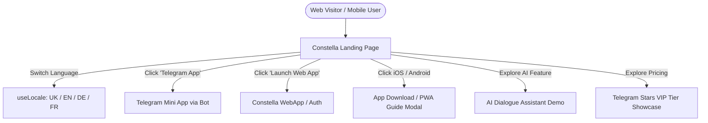

# Requirements

### Overview & Goals
Мета — створити сучасний, висококонверсійний та естетичний **лендінг (Landing Page)** для дейтинг-платформи **Constella**, адаптований під фірмову космічну стилістику бренду, з повною мультимовністю (UK, EN, DE, FR), посиланнями на запуск WebApp, Telegram-бота, застосунки iOS / Android (App Store / Google Play / PWA), інтеграцією в процес розгортання Vercel та детальним висвітленням ключової преміум-фічі — **персонального AI-помічника у діалогах**, який аналізує профіль співрозмовника та історію листування.

### Scope
- **In Scope**:
  - Розробка повнофункціонального лендінгу (`LandingPage.vue`) з адаптивним mobile-first дизайном та космічною темною темою.
  - Секції лендінгу:
    - **Hero Section**: Яскравий космічний заголовок, динамічні зірки/сузір'я, заклики до дії (CTA: Відкрити WebApp, Запустити в Telegram, Завантажити для iOS та Android).
    - **AI Assistant Spotlight (Преміум-фіча)**: Детальна презентація розумного AI-помічника у чатах — генерація влучних айсбрейкерів, аналіз інтересів та тональності розмови, підказки для розвитку діалогу в VIP-плані.
    - **Core Features**: Огляд ключових можливостей продукту (Орбіта/Свайпи 60fps, геолокація PostGIS, верифікація 18+ та AI NSFW модерація, захищені чати, аудіоповідомлення, безпечні WebRTC аудіо/відео дзвінки, взаємний обмін контактами).
    - **VIP & Gamification Tiers**: Порівняння безкоштовного доступу та VIP-підписки за Telegram Stars (AI-асистент, Incognito, Passport зміна локації, безлімітні свайпи, Boost, захист стріків).
    - **How It Works**: Покроковий флоу користувача (1. Авторизація через TG/Email → 2. Налаштування сузір'я інтересів → 3. Метчі та змістовне спілкування).
    - **App Download & Platforms**: Інтерактивні кнопки та бейджі для WebApp, Telegram Bot, iOS App Store, Google Play та PWA-інсталяції.
    - **FAQ & Trust/Safety**: Інтерактивний акордеон частих запитань про конфіденційність, безпеку даних і правила спільноти.
    - **Footer**: Посилання на правила сервісу, політику конфіденційності, підтримку та мовний перемикач.
  - **Мультимовність**: Повна локалізація всього тексту лендінгу 4 мовами (Українська, English, Deutsch, Français) через композицію `useLocale.ts`.
  - **Маршрутизація та розгортання**: Підтримка прямого доступу до лендінгу за кореневою адресою або `/landing`, плавний перехід до веб-додатка (`/` або перемикач "Увійти / Запустити"), адаптація конфігурацій `vercel.json`, `constella.deploy.config.json` та інструкцій.
- **Out of Scope**:
  - Публікація бінарних збірок у реальні акаунти Apple App Store / Google Play Console (на лендінгу надаються прямі посилання, QR-коди, бейджі та модальні вікна PWA / швидкого старту).

### User Stories
- **Як потенційний користувач**, я хочу побачити привабливий опис продукту, щоб зрозуміти, чим Constella відрізняється від інших дейтинг-сервісів (атмосфера, AI-помічник, безпека).
- **Як мобільний користувач**, я хочу в один клік запустити додаток у Telegram або відкрити Web-версію на своєму смартфоні чи планшеті.
- **Як іноземний гість**, я хочу переглядати лендінг своєю рідною мовою (UK/EN/DE/FR) з можливістю швидкого перемикання.
- **Як VIP-користувач**, я хочу бачити переваги преміум-підписки (включаючи можливості розумного AI-асистента в чаті).

### Functional Requirements
1. **Hero & Quick Action Bar**:
   - Логотип Constella з анімованим свіченням.
   - Головний CTA: кнопка «Відкрити в Telegram» та «Запустити Web-додаток».
   - Кнопки завантаження iOS (App Store) та Android (Google Play / APK / PWA).
   - Інтерактивний мокап інтерфейсу карток сузір'їв.
2. **AI Dialogue Assistant Showcase**:
   - Інтерактивний блок демонстрації роботи штучного інтелекту в чаті.
   - Візуалізація: аналіз профілю партнера (хобі, біо) $\rightarrow$ генерація персоналізованого компліменту або теми для розмови $\rightarrow$ підказка в інтерфейсі повідомлення.
   - Бейдж «VIP Feature / Constella Premium».
3. **Мультимовний перемикач**:
   - Компонент вибору мови у шапці та футері з миттєвим перемиканням без перезавантаження сторінки.
4. **Інтерактивні модальні вікна завантаження**:
   - При кліку на iOS/Android відкривається зручне модальне вікно з QR-кодом для швидкого переходу з мобільного та інструкцією встановлення як PWA / запуску Telegram Mini App.

# Technical Design

### Current Implementation
У `apps/web` додаток побудований на базі Nuxt 3 (SSR/SPA) з клієнтським роутингом у `app.vue`. Інтернаціоналізація реалізована за допомогою легкої реактивної системи `composables/useLocale.ts` із підтримкою 4 мов (`uk`, `en`, `de`, `fr`).

### Key Decisions
1. **Компонентна архітектура лендінгу (`LandingPage.vue`)**:
   - *Рішення*: Створення самостійного преміум-компонента лендінгу, інтегрованого з `app.vue` та `useLocale.ts`.
   - *Обґрунтування*: Забезпечує легку підтримку, миттєве завантаження без важких сторонніх бібліотек та збереження єдиного стилю з основним додатком.
2. **Розширення словника `useLocale.ts`**:
   - *Рішення*: Додавання структурованих ключів `landing.*` для всіх розділів (hero, ai_assistant, features, platforms, pricing, faq, footer) 4 мовами.
   - *Обґрунтування*: Зберігає повну синхронізацію мовного стану між лендінгом і додатком.
3. **Smart Platform Switcher & Deep Links**:
   - *Рішення*: Автоматичне визначення платформи користувача (iOS/Android/Desktop) з підсвічуванням відповідного варіанту встановлення та динамічним відкриттям `https://t.me/<BOT_USERNAME>` або WebApp.
4. **Інтеграція в процес розгортання**:
   - *Рішення*: Підтримка роботи лендінгу як на основному домені (`https://test.constella.pp.ua` або `https://constella.pp.ua`), так і за роутом `/landing` на `app-test.constella.pp.ua`.

### Architecture Diagram

### File Structure & Affected Components
- `apps/web/components/LandingPage.vue` — новий компонент преміального лендінгу із секціями Hero, AI Assistant, Features, Pricing, FAQ, Footer.
- `apps/web/composables/useLocale.ts` — розширення локалізаційних ключів `landing.*` (UK, EN, DE, FR).
- `apps/web/app.vue` — інтеграція перемикання між Landing Page та WebApp інтерфейсом (за наявності авторизації, query-параметрів або кнопки переходу).
- `constella.deploy.config.json` та `constella.deploy.config.example.json` — синхронізація URL та посилань лендінгу.
- `DEPLOYMENT_INSTRUCTIONS_FOR_AI.md` — оновлення документації розгортання.

# Testing

### Validation Approach
Перевірка візуального відображення, інтерактивності, адаптивності на різних екранах, роботи мовного перемикача та коректності переходів за посиланнями.

### Key Scenarios
1. **Відображення лендінгу та навігація**:
   - Перевірка відкриття лендінгу, коректної анімації карток та інтерактивних елементів.
2. **Перемикання мов (UK / EN / DE / FR)**:
   - Перевірка коректного перекладу всіх блоків (Hero, AI Assistant, Features, Pricing, FAQ, Footer).
3. **Робота CTA-кнопок та модалок**:
   - Перевірка генерації посилань на Telegram-бота, відкриття WebApp та модального вікна завантаження застосунків.
4. **Тестування мобільної версії**:
   - Адаптивність шапки, мобільного меню, карток функцій та таблиці порівняння VIP-планів.

# Delivery Steps

### ✓ Step 1: Розробка багатомовного контенту та розширення системи локалізації
Словник `useLocale.ts` містить повний набір перекладів (UK, EN, DE, FR) для всіх секцій лендінгу, включаючи презентацію AI-помічника.

- Додати групу ключів `landing.hero.*` (слоган, підзаголовок, кнопки запуску).
- Додати групу ключів `landing.ai_assistant.*` (опис AI-аналізу профілів та переписки, генерація айсбрейкерів, VIP-переваги).
- Додати групу ключів `landing.features.*`, `landing.pricing.*`, `landing.platforms.*`, `landing.faq.*` та `landing.footer.*`.

### * Step 2: Створення компонента Landing Page з AI-асистентом та космічним UI
Створено повноцінний адаптивний компонент `LandingPage.vue` з сучасною темною космічною естетикою.

- Реалізувати секцію Hero з анімованим бекграундом та швидкими посиланнями на Web/Telegram/iOS/Android.
- Створити інтерактивний блок-вітрину AI-помічника у діалогах з демонстрацією аналізу профілю та контекстних підказок.
- Додати секції ключових можливостей продукту (орбіта, свайпи, дзвінки, верифікація) та тарифну сітку Free vs VIP.
- Реалізувати інтерактивний акордеон FAQ, модальні вікна завантаження додатків та футер із правовою інформацією.

###   Step 3: Інтеграція в роутинг додатку, конфігурації розгортання та тестування
Лендінг повністю інтегровано в життєвий цикл додатку `apps/web`, налаштовано плавний перехід до авторизації/WebApp та оновлено конфігурації Vercel.

- Оновити `app.vue` для підтримки режиму лендінгу при прямому вході через браузер або за роутом `/landing`.
- Оновити `constella.deploy.config.json` та `DEPLOYMENT_INSTRUCTIONS_FOR_AI.md`.
- Запустити повний цикл unit-тестів та компіляції (`pnpm test` & `pnpm build`) для гарантії безпомилкової роботи.